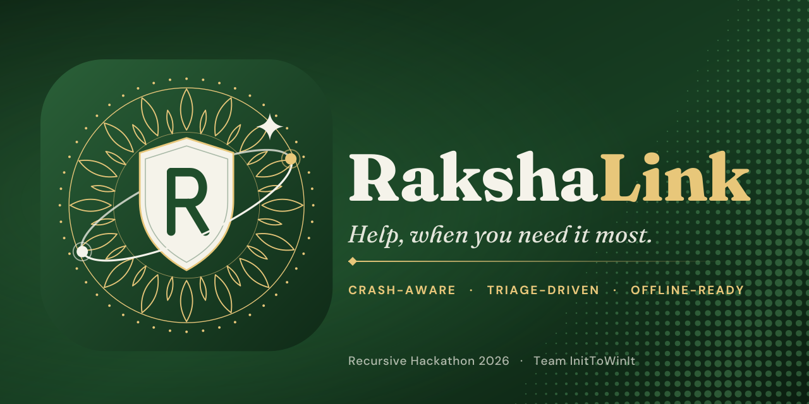
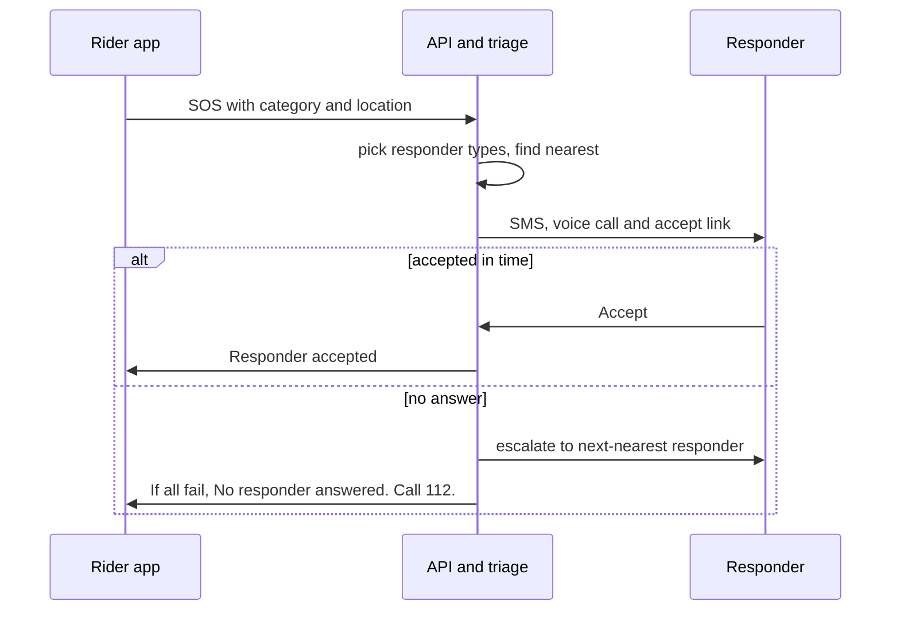
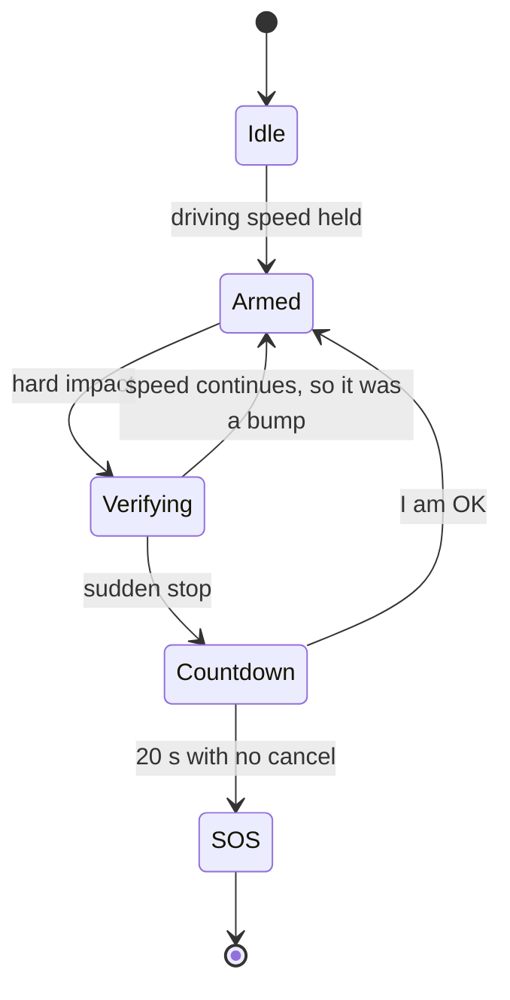
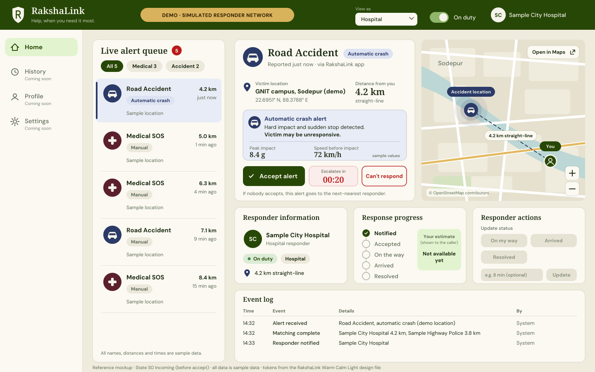
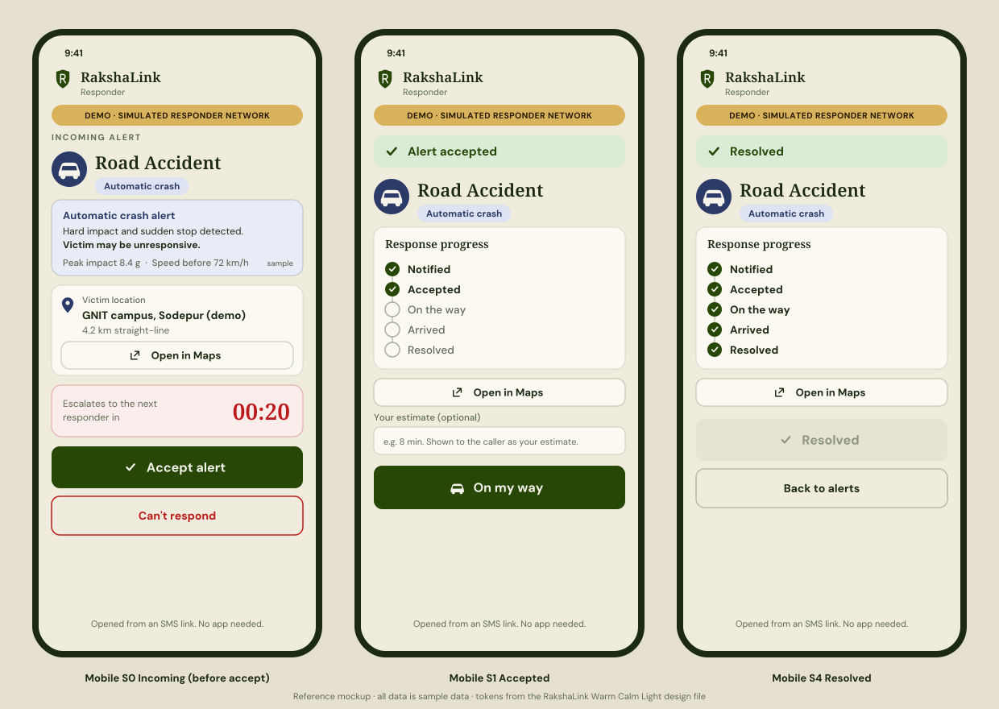

<p align="center">
  
</p>

<h3 align="center">Not just an SOS button.<br>A triage agent that knows exactly who to call, online or off.</h3>

<p align="center">
  
  
  
</p>
<p align="center">
  
  
  
  
</p>

<p align="center">
  <a href="#why-rakshalink-exists">Why</a> &nbsp;·&nbsp;
  <a href="#what-it-does">Features</a> &nbsp;·&nbsp;
  <a href="#how-it-works">How it works</a> &nbsp;·&nbsp;
  <a href="#design">Design</a> &nbsp;·&nbsp;
  <a href="#build-status">Status</a> &nbsp;·&nbsp;
  <a href="#safety-and-honesty">Safety</a> &nbsp;·&nbsp;
  <a href="#team-inittowinit">Team</a>
</p>

<p align="center"></p>

<table align="center">
  <tr>
    <td align="center" width="33%"><b>One tap, or no tap</b><br><sub>Four emergencies on one screen. Drive Mode can raise an alert after a detected crash, with a 20-second cancel window.</sub></td>
    <td align="center" width="33%"><b>The right responder</b><br><sub>Hospital, police, mechanic or fuel pump, chosen by category and real distance. Escalates if nobody answers.</sub></td>
    <td align="center" width="33%"><b>Built for weak signal</b><br><sub>No data: a prefilled SMS. No signal: a Morse flash for people nearby, and the alert is saved until signal returns.</sub></td>
  </tr>
</table>

<details>
<summary><b>Judge's 60-second tour</b></summary>

1. Look at the **[Build status](#build-status)** table: every tick was earned during the 8-hour window.
2. See the **[Design](#design)** section and the architecture in [docs/ARCHITECTURE.md](docs/ARCHITECTURE.md).
3. Read what is **real versus simulated** in [docs/DEMO.md](docs/DEMO.md).
4. Read our limits and promises in [docs/SAFETY_AND_HONESTY.md](docs/SAFETY_AND_HONESTY.md).
5. The demo video and slides are linked under [Submission links](#submission-links).
</details>

<p align="center"></p>

## Why RakshaLink exists

According to the Ministry of Road Transport and Highways (*Road Accidents in India 2023*, as cited in our idea deck), India recorded **4,80,583 road accidents** and **1,72,890 deaths** in 2023, about **20 deaths every hour**. Most emergency apps assume you have signal, can unlock your phone, and can say clearly what you need. On a highway, you often can't.

<!-- TODO(G6): re-verify every figure above against the MoRTH report before submission. -->

RakshaLink is built for that moment: one tap, one spoken sentence, or **no tap at all**.

## What it does

*These are our design goals. The [Build status](#build-status) table shows what is actually live.*

| | |
|---|---|
| **Four emergencies, four colours** | Fuel, Breakdown, Accident, Medical SOS. Each routes to the *right kind* of responder, not a generic dispatch. |
| **Explainable triage** | Deterministic rules map the emergency to responder types and find the nearest ones by real distance. Anything an AI model suggests is validated against the four known categories before it can act. |
| **Drive Mode (crash-aware)** | The phone watches for a hard impact followed by a sudden stop. A single bump or speed breaker never triggers it. If it does fire, a **20-second alarm countdown** lets you cancel. If you can't, help is sent for you. |
| **A responder side, not just a victim side** | A desktop **Responder Console** and a mobile accept page. Responders go on duty, see an alert ring with a countdown, accept or decline, then mark On the way, Arrived and Resolved. The rider sees only real statuses. |
| **Escalation, not hope** | If nobody accepts in time, the alert moves to the next-nearest responder. If everyone fails, the app says so and puts **Call 112** front and centre. |
| **Offline ladder** | Data works: call the API. No data: a prefilled SMS. No signal: a Morse SOS flash and sound for people nearby, and the alert is queued until signal returns. |

### How it compares with a plain SOS button

| | Plain SOS button | RakshaLink (design goal) |
|---|---|---|
| Routes by emergency type | one generic dispatch | hospital, police, mechanic or fuel pump |
| Works if the victim cannot tap | no | Drive Mode crash countdown |
| Responder side with accept and status steps | rarely | Responder Console and accept page |
| Handles "nobody answered" | silent | escalates, then tells the rider to call 112 |
| Weak or no signal | fails | SMS fallback, Morse flash, saved queue |

> RakshaLink **augments** India's 112 emergency number; it does not replace it. A Call 112 button is on every screen.

<p align="center"></p>

## How it works

```mermaid
flowchart LR
    A["📱 Rider app<br/>tap · speak · crash"] --> B["RakshaLink API"]
    B --> C{"Triage<br/>rules"}
    C -->|medical| D["🏥 nearest hospital"]
    C -->|accident| E["🏥 hospital + 🚓 police"]
    C -->|breakdown| F["🔧 nearest mechanic"]
    C -->|fuel| G["⛽ nearest fuel pump"]
    D & E & F & G --> H["SMS + voice + accept link"]
    H --> I["🖥️ Responder Console"]
    I -->|accept| J["✅ Rider sees: Responder accepted"]
    I -.->|no answer| K["⏭️ next-nearest responder"]
```





### Drive Mode: crash detection that avoids false alarms



Speed context, an impact spike, and a sudden stop must all agree. Thresholds are starting values and are **not validated on real crashes**. See [docs/SAFETY_AND_HONESTY.md](docs/SAFETY_AND_HONESTY.md).

## Design

Calm under stress: big targets, plain words, one dominant action per screen, and one colour per emergency (Fuel green, Breakdown teal, Accident navy, Medical maroon).

<p align="center">
  
</p>
<p align="center">
  
</p>
<p align="center"><sub>Design references rendered from <a href="docs/DESIGN_TOKENS.md">our design tokens</a>. Screenshots of the working product are added at submission.</sub></p>

<p align="center"></p>

## Build status

*Updated live during the hackathon. A tick means it ran.*

| Tier | Feature | Status |
|---|---|---|
| T1 | One-tap SOS (4 categories) with location | ⬜ |
| T1 | Triage + nearest-responder matching | ⬜ |
| T1 | Dispatch (mock or real SMS/voice) | ⬜ |
| T1 | Responder Console + accept page | ⬜ |
| T1 | Live status with real flags | ⬜ |
| T1 | Drive Mode: simulate crash, 20 s countdown, auto SOS | ⬜ |
| T2 | On-duty toggle, On the way / Arrived / Resolved, role views | ⬜ |
| T2 | Auto-escalation | ⬜ |
| T2 | Offline ladder (SMS fallback, Morse, queue) | ⬜ |
| T2 | Sensor-based crash detector | ⬜ |
| T2 | Family alert, time-to-dispatch metric | ⬜ |
| T3 | Voice SOS, language toggle, share, history | ⬜ |
| T3 | Responder history, operations overview | ⬜ |

## Tech stack

| Layer | Choice |
|---|---|
| Rider app | Mobile web app (opens in any phone browser) |
| Backend | Node.js + Express, Server-Sent Events for live updates |
| Matching | in-memory store with haversine nearest search |
| Comms | SMS gateway and text-to-speech voice, behind a mock/real provider switch |
| Maps | OpenStreetMap |

## Repository layout

```text
rakshalink/
├── assets/     logo, banner, social preview, divider
├── docs/       architecture, API contract, safety and honesty, design, demo, roadmap
├── server/     API, triage, dispatch, escalation
├── mobile/     native app (Expo), planned, not part of the 8-hour build
├── web/        rider app (mobile web), responder console, accept page
└── .env.example
```

## Getting started

Setup steps are added at the final gate of the hackathon, once the code exists. Planned configuration names are in [`.env.example`](.env.example).

## Safety and honesty

- **Demo mode by default.** Alerts go only to team-owned test numbers. No real hospital, police station, or emergency service is ever contacted.
- **The responder network in the demo is simulated** and labelled so. Responder locations come from OpenStreetMap. Phone numbers are demo numbers.
- **The app never says help is coming unless a responder actually accepted.**
- **Dispatch can run in simulation mode**, and simulated dispatch is always labelled as such.
- Motion data stays on the phone. Only a short summary is sent when an alert fires.

Full details: [docs/SAFETY_AND_HONESTY.md](docs/SAFETY_AND_HONESTY.md).

## Roadmap

Proposals, not commitments: one pilot highway corridor, then state highways, then a national network, with responder onboarding done together with official systems such as 112. See [docs/ROADMAP.md](docs/ROADMAP.md).

## Team InitToWinIt

Guru Nanak Institute of Technology (GNIT), Kolkata.

| Name | Role |
|---|---|
| Ashish Chandra Acharjee | Team Lead |
| Pranay Saha | Team member |
| Nitin Agarwal | Team member |
| Ayush Mahato | Team member |

## Submission links

| Item | Link |
|---|---|
| Demo video | _added at submission_ |
| Slides | _added at submission_ |
| Live demo | _added at submission_ |

<p align="center"></p>

<p align="center"><sub>Map and responder data © <a href="https://www.openstreetmap.org/copyright">OpenStreetMap contributors</a>. Accident statistics: MoRTH, <i>Road Accidents in India 2023</i>. Built for the <b>Recursive</b> hackathon at GNIT. Released under the <a href="LICENSE">MIT License</a>.</sub></p>


